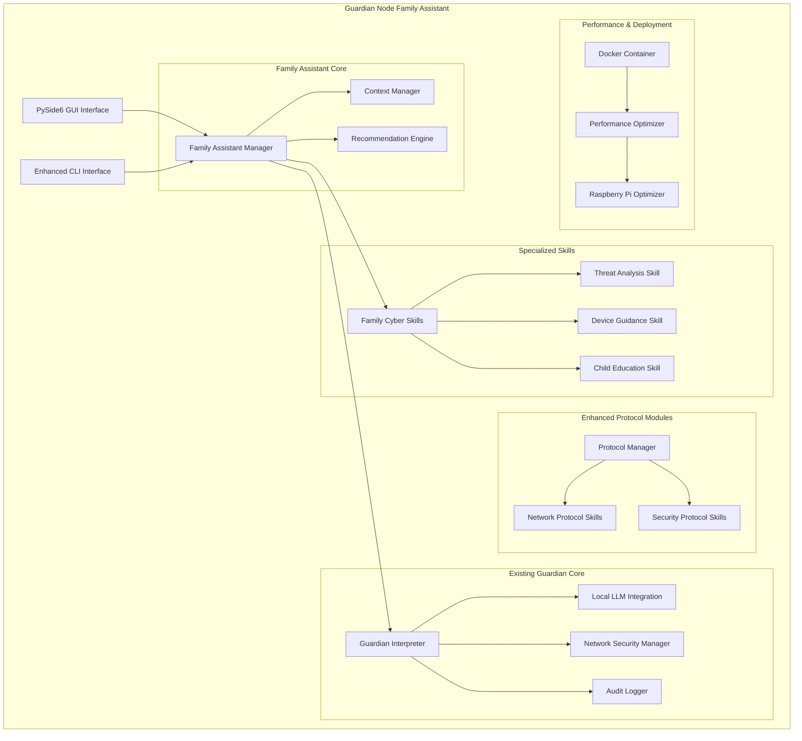

# Design Document

## Overview

The Guardian Node Family Cybersecurity Assistant extends the existing Guardian Interpreter framework with specialized capabilities for helping non-technical families understand and improve their digital security. The design leverages the existing modular skills system, local LLM integration, and privacy-first architecture while adding family-friendly interfaces and specialized cybersecurity guidance capabilities.

The assistant operates as a collection of specialized skills and interface enhancements that transform the Guardian Node from a technical security tool into an accessible family cybersecurity advisor, maintaining all existing privacy and offline-first principles.

## Architecture

### High-Level Architecture



### Integration with Existing Guardian Architecture

The family assistant integrates seamlessly with the existing Guardian Interpreter by:

1. **Extending the Skills System**: Adding family-focused cybersecurity skills that use the existing skill loading and execution framework
2. **Enhancing the LLM Integration**: Providing family-friendly system prompts and response formatting
3. **Leveraging Network Security**: Using existing NetworkSecurityManager for safe family guidance
4. **Building on Audit Logging**: Extending AuditLogger for family activity tracking

## Components and Interfaces

### 1. Family Assistant Manager

**Purpose**: Central coordinator for family-specific cybersecurity assistance

**Key Responsibilities**:
- Route family cybersecurity queries to appropriate skills
- Manage family-friendly response formatting
- Coordinate between GUI and CLI interfaces
- Handle family context and preferences

**Interface**:
```python
class FamilyAssistantManager:
    def process_family_query(self, query: str, context: dict) -> dict
    def get_family_recommendations(self, family_profile: dict) -> list
    def format_family_response(self, technical_response: str) -> str
    def manage_family_context(self, user_id: str) -> dict
```

### 2. PySide6 GUI Interface

**Purpose**: Provide intuitive graphical interface for non-technical family members

**Key Features**:
- Simple, clean interface with large buttons and clear text
- Visual threat indicators and security status
- Step-by-step guidance wizards
- Family member profiles and device management
- Child-friendly educational modules

**Interface Components**:
- Main Dashboard: Security status overview
- Query Interface: Natural language cybersecurity questions
- Recommendation Panel: Prioritized security actions
- Family Manager: Device and member profiles
- Education Center: Child cybersecurity learning modules

### 3. Enhanced Protocol Modules

**Purpose**: Extend network analysis capabilities with family-relevant protocols

**Modules**:
- **Home Network Analyzer**: Router security, WiFi configuration, IoT device detection
- **Parental Control Analyzer**: Content filtering, time restrictions, device monitoring
- **Smart Home Security**: IoT device security assessment, privacy analysis
- **Social Media Safety**: Platform-specific security guidance, privacy settings

### 4. Specialized Family Skills

#### 4.1 Family Cyber Skills (`family_cyber_skills.py`)
- Main entry point for family cybersecurity queries
- Routes questions to specialized sub-skills
- Formats responses in family-friendly language

#### 4.2 Threat Analysis Skill (`threat_analysis_skill.py`)
- Analyzes current cybersecurity threats relevant to families
- Provides context-aware threat explanations
- Prioritizes threats by family impact

#### 4.3 Device Guidance Skill (`device_guidance_skill.py`)
- Provides security guidance for common family devices
- Supports phones, tablets, computers, smart home devices
- Age-appropriate recommendations for different family members

#### 4.4 Child Education Skill (`child_education_skill.py`)
- Generates age-appropriate cybersecurity education content
- Provides conversation starters for parents
- Creates interactive learning activities

### 5. Performance Optimization System

**Purpose**: Ensure responsive performance on Raspberry Pi and resource-constrained environments

**Components**:
- **Memory Manager**: Efficient LLM model loading and unloading
- **Response Cache**: Cache common family cybersecurity responses
- **Resource Monitor**: Track CPU, memory, and storage usage
- **Priority Queue**: Prioritize family safety queries over system tasks

### 6. Docker Containerization

**Purpose**: Simplify deployment and maintenance across different environments

**Container Structure**:
```
guardian-node-container/
├── guardian_interpreter/     # Core application
├── family_assistant/         # Family-specific components
├── models/                   # LLM models
├── config/                   # Configuration files
├── logs/                     # Persistent log storage
└── data/                     # Family profiles and preferences
```

**Container Features**:
- Offline-first operation (no external network dependencies)
- Persistent storage for family data and preferences
- Health checks and automatic recovery
- Resource limits appropriate for Raspberry Pi

## Data Models

### Family Profile Model
```python
@dataclass
class FamilyProfile:
    family_id: str
    family_name: str
    members: List[FamilyMember]
    devices: List[Device]
    security_preferences: SecurityPreferences
    threat_tolerance: str  # "low", "medium", "high"
    created_at: datetime
    updated_at: datetime
```

### Family Member Model
```python
@dataclass
class FamilyMember:
    member_id: str
    name: str
    age_group: str  # "child", "teen", "adult"
    tech_skill_level: str  # "beginner", "intermediate", "advanced"
    devices: List[str]  # Device IDs
    special_needs: List[str]  # Accessibility, learning differences, etc.
```

### Device Model
```python
@dataclass
class Device:
    device_id: str
    device_type: str  # "smartphone", "tablet", "computer", "iot"
    os_type: str
    os_version: str
    owner: str  # Family member ID
    security_status: SecurityStatus
    last_assessed: datetime
```

### Security Recommendation Model
```python
@dataclass
class SecurityRecommendation:
    recommendation_id: str
    title: str
    description: str
    priority: str  # "critical", "high", "medium", "low"
    difficulty: str  # "easy", "moderate", "advanced"
    estimated_time: str
    steps: List[str]
    applicable_devices: List[str]
    family_members: List[str]
```

## Error Handling

### Graceful Degradation Strategy
1. **LLM Unavailable**: Fall back to pre-written family cybersecurity guidance
2. **GUI Failure**: Automatically switch to enhanced CLI mode
3. **Skill Loading Errors**: Continue with available skills, log missing functionality
4. **Network Issues**: Maintain full offline functionality, log connectivity status
5. **Resource Constraints**: Prioritize family safety queries, defer non-critical tasks

### Error Recovery Mechanisms
- **Auto-restart**: Automatic recovery from transient failures
- **State Persistence**: Save family profiles and preferences across restarts
- **Diagnostic Mode**: Built-in troubleshooting and system health checks
- **Fallback Responses**: Pre-configured responses for common family cybersecurity questions

## Testing Strategy

### Unit Testing
- **Family Skills Testing**: Validate each family cybersecurity skill independently
- **GUI Component Testing**: Test PySide6 interface components and interactions
- **LLM Integration Testing**: Verify family-friendly response formatting
- **Performance Testing**: Validate resource usage on Raspberry Pi hardware

### Integration Testing
- **End-to-End Family Scenarios**: Complete family cybersecurity assistance workflows
- **Cross-Platform Testing**: Validate Docker container deployment across environments
- **Offline Operation Testing**: Ensure complete functionality without internet access
- **Multi-User Testing**: Validate family profile management and member-specific guidance

### User Acceptance Testing
- **Family Usability Testing**: Test with actual families of varying technical skill levels
- **Child Interface Testing**: Validate age-appropriate educational content and interfaces
- **Accessibility Testing**: Ensure interface works for users with different abilities
- **Performance Validation**: Confirm responsive operation on target hardware

### Security Testing
- **Privacy Validation**: Ensure all family data remains local and encrypted
- **Network Security Testing**: Validate offline-first operation and network blocking
- **Audit Trail Testing**: Verify comprehensive logging without privacy violations
- **Container Security Testing**: Validate Docker container security and isolation

## Deployment Architecture

### Raspberry Pi Deployment
```
Raspberry Pi 5 (16GB RAM)
├── Guardian Node Container
│   ├── Guardian Interpreter Core
│   ├── Family Assistant GUI (PySide6)
│   ├── Local LLM (GGUF model)
│   └── Family Skills & Protocols
├── Touchscreen Interface
├── Local Storage (32GB+ SD Card)
└── Network Interface (WiFi/Ethernet)
```

### Performance Optimizations for Raspberry Pi
- **Model Quantization**: Use 4-bit quantized GGUF models for efficient inference
- **Memory Management**: Dynamic model loading/unloading based on usage
- **CPU Optimization**: Multi-threaded processing with ARM-specific optimizations
- **Storage Optimization**: Compressed logs and efficient data structures
- **Power Management**: Intelligent sleep modes for battery-powered operation

### Container Orchestration
- **Health Monitoring**: Continuous health checks and automatic recovery
- **Resource Limits**: CPU and memory limits appropriate for Raspberry Pi
- **Volume Management**: Persistent storage for family data and model files
- **Network Isolation**: Enforce offline-first operation at container level
- **Update Management**: Secure, offline-capable update mechanisms

## Configuration Integration

The family assistant extends the existing Guardian Interpreter configuration with additional sections:

```yaml
# Family Assistant Configuration (extends existing config.yaml)
family_assistant:
  enabled: true
  gui_enabled: true
  default_interface: "gui"  # "gui" or "cli"
  family_data_path: "data/families"
  
  # Family-specific LLM settings
  family_llm:
    system_prompt_template: "family_assistant_prompt.txt"
    max_response_length: 1000
    child_safe_mode: true
    
  # GUI Configuration
  gui:
    theme: "family_friendly"
    font_size: "large"
    high_contrast: false
    touch_interface: true
    screen_timeout: 300  # seconds
    
  # Family Skills Configuration
  family_skills:
    threat_analysis_enabled: true
    device_guidance_enabled: true
    child_education_enabled: true
    auto_recommendations: true
    
  # Performance Settings
  performance:
    cache_responses: true
    cache_size_mb: 50
    background_analysis: false
    priority_family_queries: true

# Enhanced Protocol Modules
protocol_modules:
  enabled: true
  modules_directory: "protocols"
  auto_load_family_protocols: true
  
# Docker Configuration
docker:
  container_name: "guardian-node-family"
  restart_policy: "unless-stopped"
  memory_limit: "12g"  # For Raspberry Pi 5 16GB
  cpu_limit: "3.0"
  
# Raspberry Pi Optimizations
raspberry_pi:
  enabled: true
  model: "pi5"
  optimize_for_arm: true
  gpu_acceleration: false
  thermal_management: true
  power_save_mode: false
```